# EPFH Website Revamp — Design Report

## Overview

This report outlines the key changes made in the EPFH website revamp prototype, comparing them directly against the current live site. For each change we explain what the problem was and what we did about it.

---

## Side-by-Side Overview

| Current Site | Revamp Prototype |
|:---:|:---:|
| 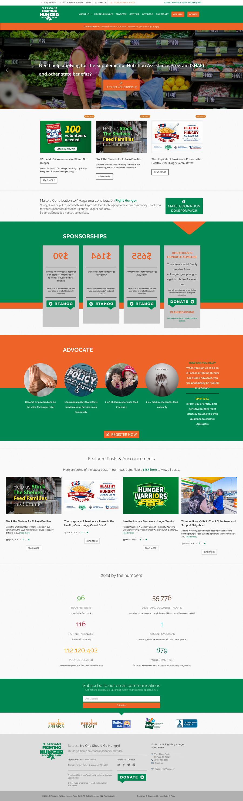 | 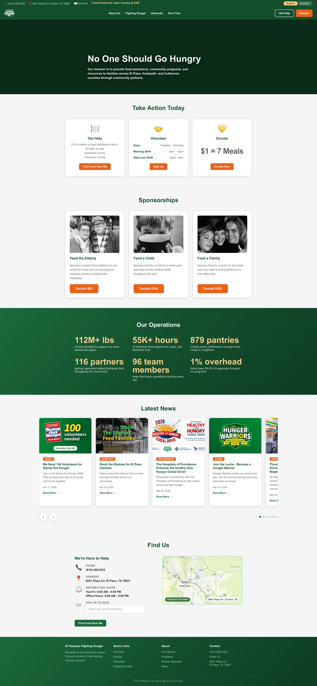 |

---

## 1. Navbar & Color Scheme

**Current site:**
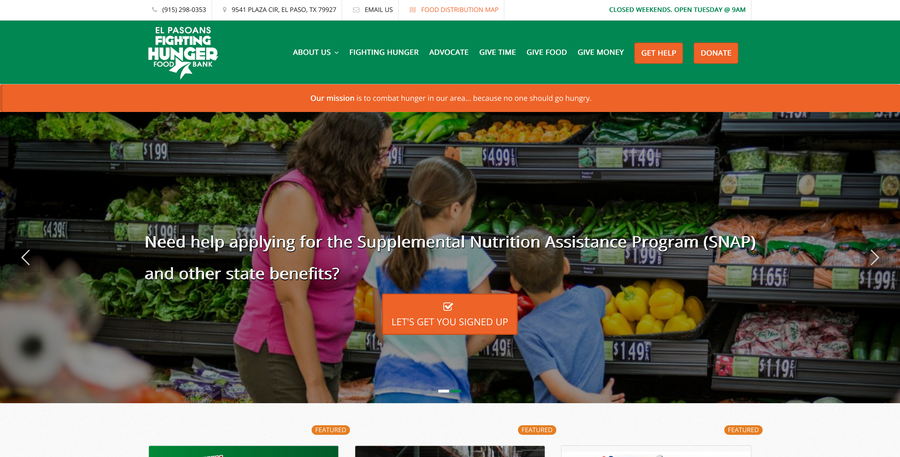

The current site uses a white navbar. Navigation links, the logo, and page content all share the same white background, making it hard to visually separate "navigation" from "page." Color is used inconsistently throughout — the Sponsorships section is green, the Advocate section is a large orange block, the stats section is plain white, and the footer is dark green. There's no unified visual logic connecting these sections.

**Revamp:**
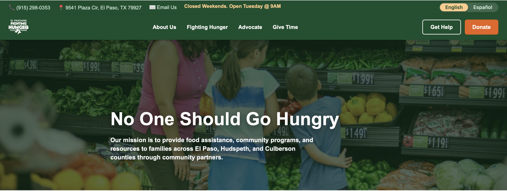

The revamp anchors the navbar in EPFH's signature dark green, making it immediately distinct from the page content below. That same green carries through to the stats section and footer, so the color feels intentional rather than accidental. Orange is reserved strictly for action buttons throughout the entire page — if something is orange, it means "click here to do something." This consistency makes it easier for visitors to know at a glance what's navigation, what's content, and what's a call to action.

---

## 2. Logo

**Current site:** The logo is a static image that stays the same size and position at all times, regardless of scroll state or screen size. On mobile, it competes for space with the hamburger menu.

**Revamp:** The logo now adapts to how the user is browsing. Two versions are used:

| On page load (full wordmark) | While scrolling (compact star mark) |
|:---:|:---:|
| 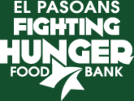 |  |

When the page first loads, the full wordmark is shown — a natural first impression. Once the user scrolls, the navbar compresses and swaps to the compact star-mark version. This keeps the page feeling clean and gives content more room to breathe while the user is actively reading.

On mobile, the difference is especially noticeable — the compact mark frees up horizontal space for the hamburger menu and action buttons.

| Mobile — Current Site | Mobile — Revamp |
|:---:|:---:|
| 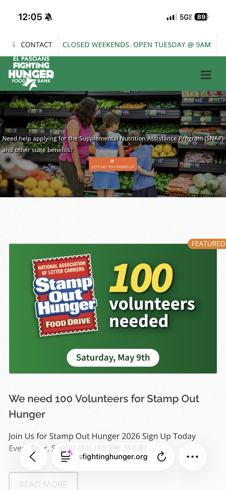 | 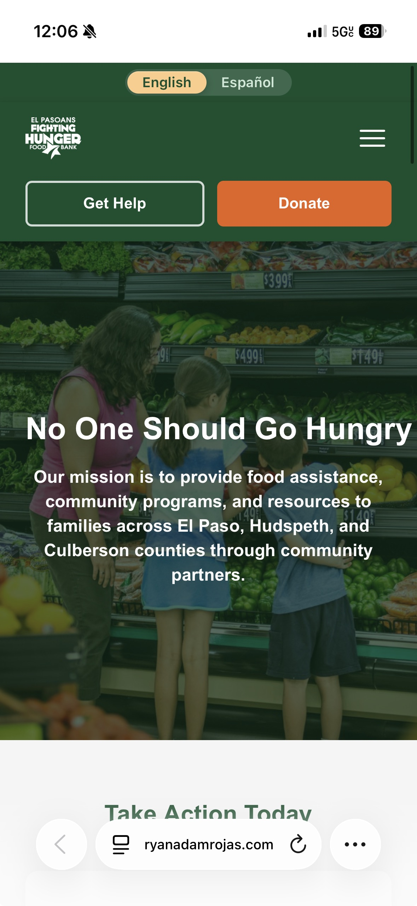 |

---

## 3. English / Spanish Toggle

**Current site:** There is no language toggle anywhere on the live site. A few isolated Spanish phrases appear on the page — "Haga una contribución" in the donation area, for example — but they feel like afterthoughts. A Spanish-speaking visitor navigating the full site encounters a page built entirely in English, with no way to change that.

**Revamp:** A full English/Español toggle sits in the top bar, visible the moment the page loads. Clicking it translates the entire page — every heading, paragraph, button, and link — into Spanish simultaneously. Nothing is left untranslated. Given that El Paso is a majority-Hispanic, bilingual city, and that many of the people EPFH most needs to reach are Spanish speakers, this is one of the most impactful changes in the revamp.

| English (default) | Español (active) |
|:---:|:---:|
| 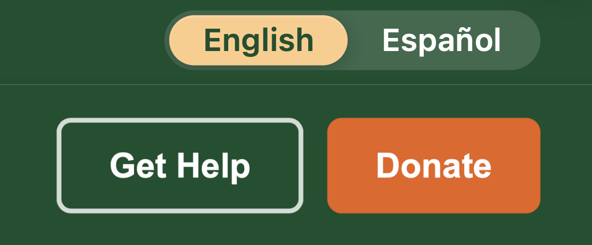 | 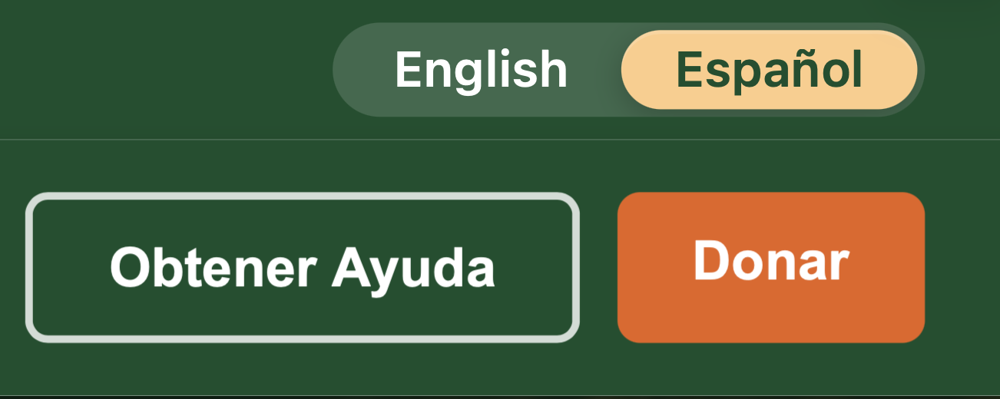 |

The toggle uses a distinct gold highlight for the active language rather than orange, so it doesn't visually compete with the donate and find-food buttons elsewhere on the page.

---

## 4. Hero Section

**Current site:** The hero's primary headline is "Need help applying for the Supplemental Nutrition Assistance Program (SNAP) and other state benefits?" This addresses one specific type of visitor — someone in immediate need of benefits assistance — and doesn't speak to the many other people who visit the site to volunteer, donate, or learn about the organization.

**Revamp:** The hero opens with **"No One Should Go Hungry"** over a full-width photo with a dark overlay. This single line works for every visitor: it's welcoming to someone seeking food assistance, it resonates with someone who wants to donate, and it immediately communicates EPFH's mission to someone new to the organization. A short paragraph below it explains where the food bank operates and who it serves. The SNAP enrollment path still exists — it just no longer needs to be the front door for everyone.

---

## 5. Navigation

| Current Site | Revamp |
|:---:|:---:|
| 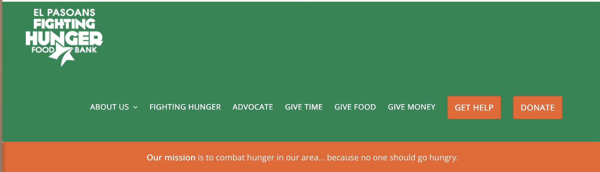 | 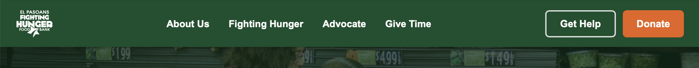 |

**Current site:** The navbar has eight top-level items: ABOUT US, FIGHTING HUNGER, ADVOCATE, GIVE TIME, GIVE FOOD, GIVE MONEY, GET HELP, DONATE. Three of those — GIVE TIME, GIVE FOOD, GIVE MONEY — are separate links for what are really three versions of the same intent: contributing to the organization.

**Revamp:** Four informational links remain in the nav — About Us, Fighting Hunger, Advocate, Give Time. The two highest-priority actions, Get Help and Donate, become visually distinct buttons on the right side of the bar. A first-time visitor can immediately identify the two most important things they might need to do without scanning eight equally-weighted options.

---

## 6. "Take Action Today" Section

**Current site:** There's no single place on the live site where a visitor can see all three ways to engage — get food, volunteer, and donate — in one view. These options are scattered across different sections of the page at different levels of prominence.

**Revamp:**

Three equal cards sit directly below the hero, each designed for a specific type of visitor:
- **Get Help** — lists all three counties in the service area so someone can confirm coverage before clicking through
- **Volunteer** — shows available days and shift times right on the card, no navigation required
- **Donate** — leads with the impact stat **$1 = 7 Meals** rather than a dollar amount, connecting the ask to real outcomes

All three cards are the same size and visual weight. EPFH needs food seekers, volunteers, and donors equally, and the design reflects that.

---

## 7. Page Structure and Redundancy

**Current site:** Several things appear more than once on the same page:
- Featured news articles show up near the top of the page, then appear again in a separate "Featured Posts" section further down
- The mission statement — "Because No One Should Go Hungry!" — is printed three times in a row at the bottom of the page
- Sponsorship amounts are listed twice within the same card
- Contact information (phone and address) appears in the top bar and again in the footer in identical format

| Redundancy example A | Redundancy example B |
|:---:|:---:|
| 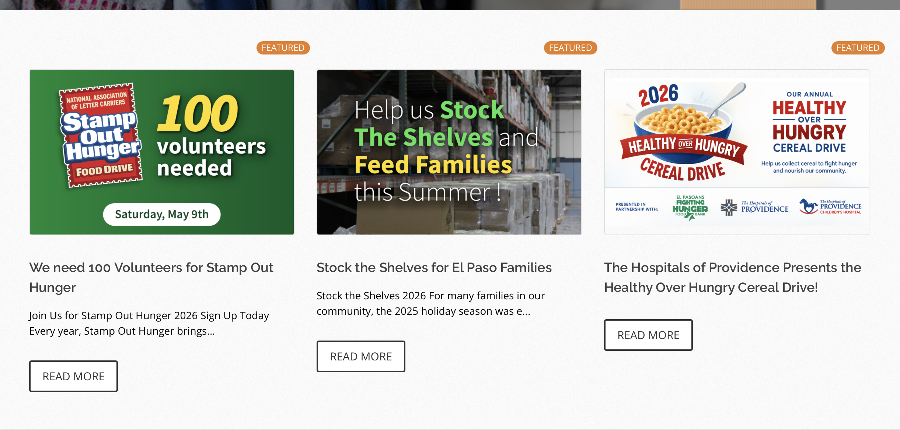 | 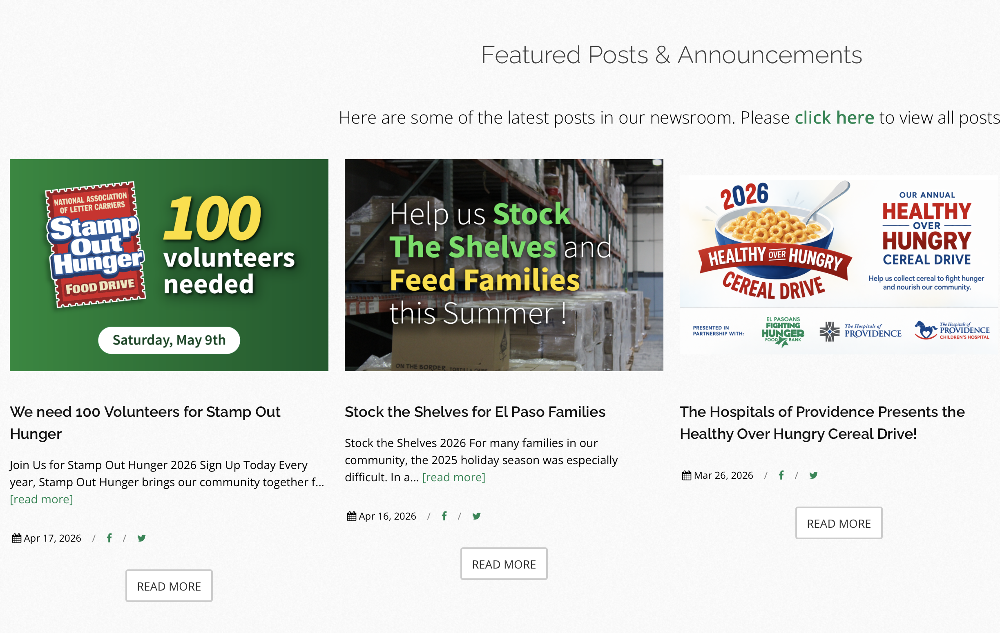 |

The page order also puts news articles before the sponsorship tiers and stats — meaning someone curious about donating or volunteering has to scroll past a lot of content before they find what they need.

**Revamp:** Each piece of information lives in one place, presented once. News is consolidated into a single scrollable carousel. The page flows logically: Hero → Take Action → Sponsorships → Our Operations → Latest News → Find Us → Footer. Visitors encounter the most important content — what they can do, and why it matters — before they hit the news section.

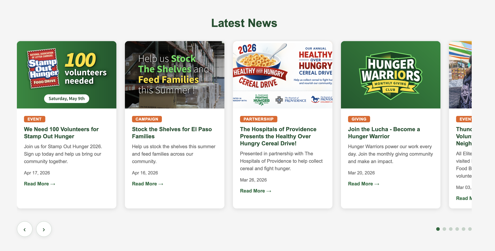

---

## 8. Statistics Section

| Current Site | Revamp |
|:---:|:---:|
| 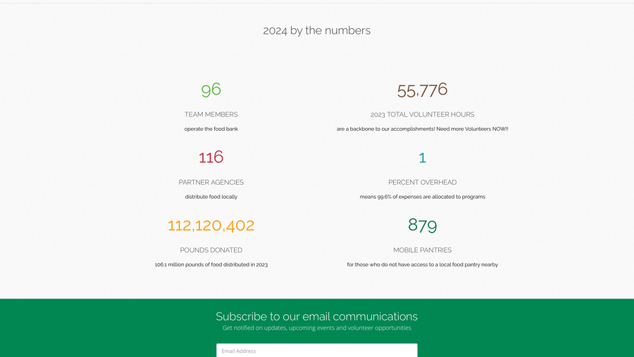 | 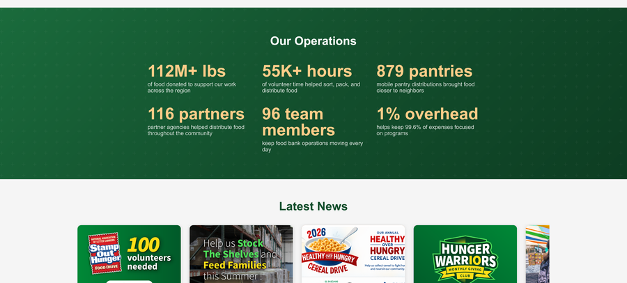 |

**Current site:** EPFH's impact numbers — 112 million pounds distributed, 55,776 volunteer hours, 879 mobile pantries, 1% overhead — sit near the bottom of the page on a plain white background. The numbers are compelling but the section doesn't do them justice visually.

**Revamp:** The stats section gets a full-width dark green background with the numbers rendered large in gold. It's the most visually dramatic section on the page, which matches how significant the numbers actually are. It's also moved earlier in the page flow — right after the sponsorship cards — so a visitor who's considering donating sees the scale of the organization's impact before they encounter the news section.

---

## 9. "Find Us" Section

| Current Site | Revamp |
|:---:|:---:|
| 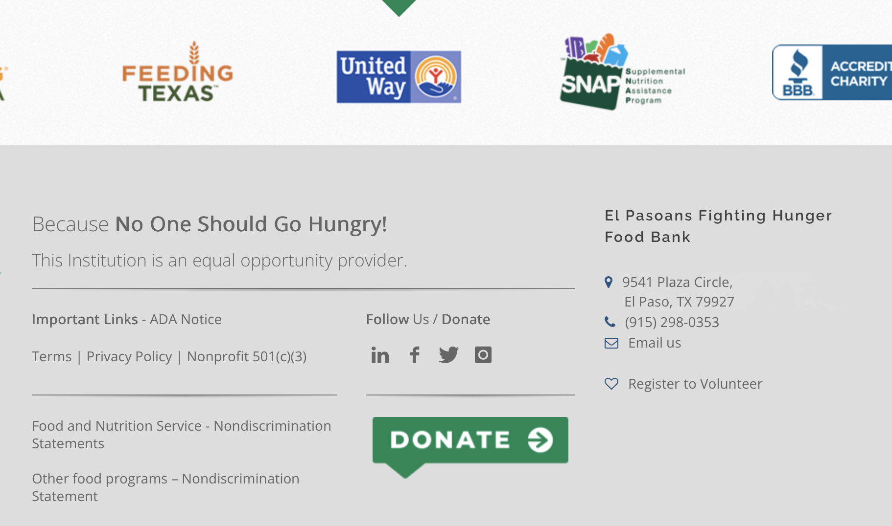 | 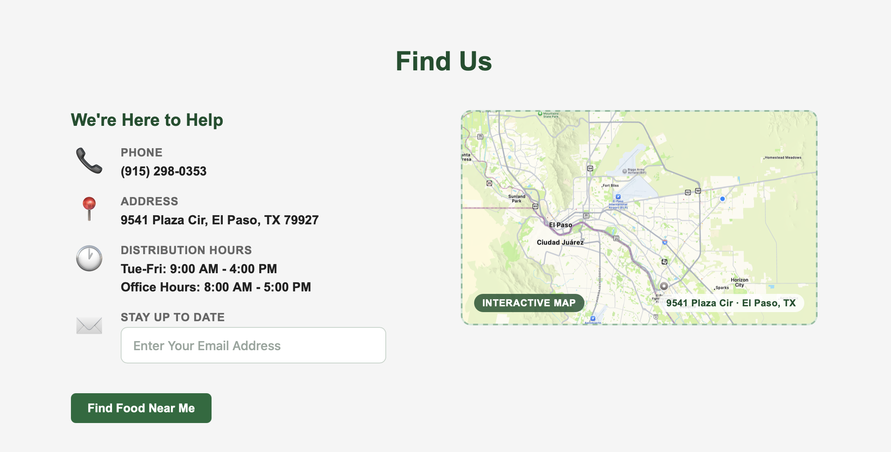 |

**Current site:** Contact information is split between the top bar (phone, address, email, hours) and the footer, where the information is treated like an afterthought. There's no dedicated section that brings all of this together in a readable format for someone who wants to physically visit the food bank.

**Revamp:** A "Find Us" section near the bottom of the page consolidates phone, address, full distribution hours, office hours, and an email signup alongside a map of El Paso. It's designed for the visitor who has read through the page and is ready to show up in person or reach out — and like everything else in the revamp, it fully translates to Spanish when the language toggle is switched.

---

## Summary

| What Changed | Why It Matters |
|---|---|
| White navbar → Dark green | Establishes brand identity immediately, separates nav from content |
| Static logo → Responsive logo | Cleaner navigation while browsing; better mobile experience |
| No language support → Full English/Español toggle | Genuine access for El Paso's Spanish-speaking community |
| SNAP hero → Mission-driven hero | Speaks to all visitors, not just one type |
| 8 nav items → 4 links + 2 action buttons | Faster orientation for new visitors |
| No action hub → "Take Action Today" cards | Volunteer, donate, and get help all visible in one place |
| Repeated content → One appearance each | Cleaner page, each element lands with more impact |
| Quiet stats section → Bold "Our Operations" | Key impact numbers get the visual prominence they deserve |
| No contact section → Dedicated "Find Us" | Everything needed to visit in person, all in one place |

---

*Report prepared April 26, 2026. Live site: elpasoansfightinghunger.org. Prototype: EPFH-Site repository, main branch.*
